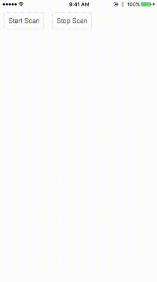

# Fuse Bluetooth

## Description
This plugin lets you connect to bluetooth peripherals from [Fuse](https://www.fusetools.com/).  It is an extension of the [Evothings BLE Cordova plugin](https://github.com/evothings/cordova-ble).

## Demo
[movie](./docs/fuse-bluetooth-example-demo-480p.mov) [gif](./docs/fuse-bluetooth-example-demo.gif)



## Limitations
- Only works on iOS for now (most of the work to make it work on Android lives in the [fuse-cordova-bridge](https://github.com/akalyan/fuse-cordova-bridge))
- Some of the APIs exposed by the Bluetooth native module are slightly different from those on the original plugin:
  - Instead of accepting device handle or `DeviceInfo` objects, this plugin only accepts the handles
  - Write operations (`writeCharacteristic`, `writeCharacteristicWithoutResponse`, `writeDescriptor`) accept a base64-encoded string as the data parameter

## Usage
You can use the included example project as an example, but the steps are:

- Add reference to this project in your .unoproj file, e.g.:
```
"Projects": [
  "../fuse-bluetooth/fuse-bluetooth.unoproj"
],
```
- Add reference to the [fuse-cordova-bridge](https://github.com/akalyan/fuse-cordova-bridge) project in your .unoproj file, e.g.:
```
"Projects": [
  "../fuse-cordova-bridge/fuse-cordova-bridge.unoproj"
],
```
- Within your project, create a cordova project to house the evothings/cordova-ble plugin that this project depends upon
```
cordova create cordova-plugins
cd cordova-plugins
```
- In that cordova project, add the plugin
```
cordova plugin add cordova-plugin-ble@2.0.1
```
- Add platform target (currently, the bridge only supports iOS)
```
cordova platform add ios
```
- Prepare the cordova project
```
cordova prepare
```
- Add references to the EVOBLE.h and EVOBLE.m files in your .unoproj file, e.g.:
```
"Includes": [
  "cordova-plugins/plugins/cordova-plugin-ble/src/ios/EVOBLE.h:ObjCHeader:iOS",
  "cordova-plugins/plugins/cordova-plugin-ble/src/ios/EVOBLE.m:ObjCSource:iOS",
  ...
]
```

## Building your project
The biggest change to the build process for a project that uses the bridge is to link the CordovaLib. To do that:

- Add `-ObjC` to 'Other linker flags' in Build Settings. Why? Cordova seems to need it to add the `cdv_JSONString`method to the `NSArray` implementation. From the docs:
> This flag causes the linker to load every object file in the library that defines an Objective-C class or category. While this option will typically result in a larger executable (due to additional object code loaded into the application), it will allow the successful creation of effective Objective-C static libraries that contain categories on existing classes.
- Link `libCordova.a`
  - Select project
  - Build Phases tab
  - Link Binaries With Libraries
  - Add items (the plus sign on the bottom of the panel)
  - Add Other
  - Select `CordovaLib.xcodeproj` (under `cordova-plugins/platforms/ios/CordovaLib/`)
  - Add items (again)
  - Select `libCordova.a`
- Add `CordovaLib` as target
  - Build Phases tab
  - Target Dependencies
  - Add items
  - Select `CordovaLib`
- Be sure to enable 'Uses Bluetooth LE accessories' on the Capabilities tab -> Background Modes
- When you build with Fuse, you'll an error regarding `CBCentralManagerScanOptionAllowDuplicatesKey` not being resolved, just ignore it. The error is benign.
